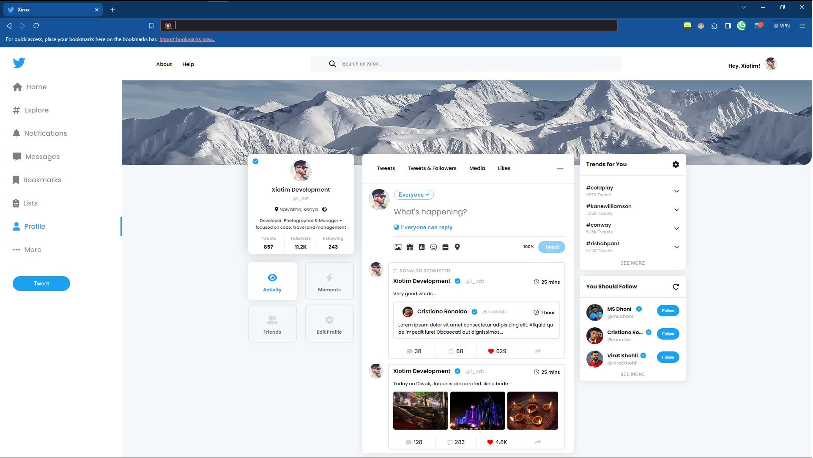
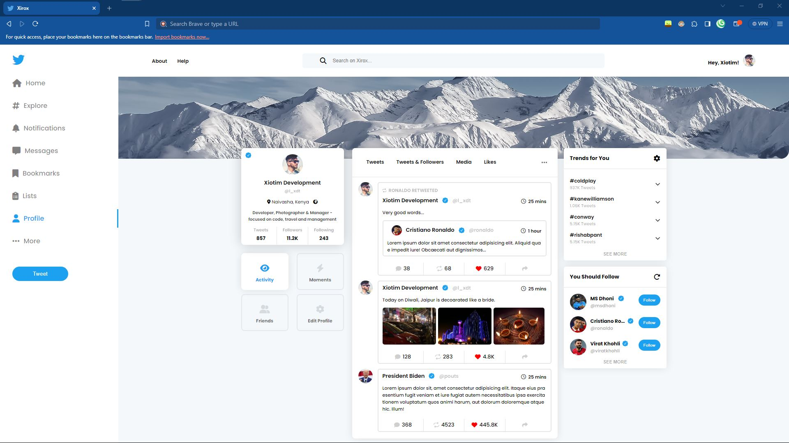

# Xirox

This Github Repository is for Xirox - a clone of Twitter (before X). This is basically for me; and for you because you get free code without wasting 4+ Hours and for me I get a free backup. You can change the background color, the Name of the Account, etc.

The pictures come from [here](https://kdscoder.com/welcome/video_source_code/K_eV7MhujeE)

**(Thanks KDS Coder!)**

## Acknowledgements

- Originally written and shown on [KDSCoders](https://www.youtube.com/channel/UCzrG46-uiv5VG0_wa5zOjvA)'s channel
- Hugest of Hugest shoutouts to: [XDT-XioTube](https://github.com/l-xdt/xiotube)
- Something that has been nothing but a G thang to me: [DiffChecker](https://www.diffchecker.com)

## Authors

- [Lidenschaft Xiotim-Development Team (Limited)](https://www.github.com/l-xdt)

- [Avun](https://github.com/avun-ai)

- [KDSCoder](https://www.youtube.com/channel/UCzrG46-uiv5VG0_wa5zOjvA)

## Demo

This project does not contain a demo; but you can find it on the address listed [here](https://l-xdt.github.io/xirox/)

## Features

- Write Tweet TextArea

- Character Counter

- Customization to the max; It is up-to you how much you want.

- Cross-browser support (for all Browsers between Gecko to Spyder)

- **PS:** Still following the same pattern as XioTube, please use 10K instead of 10,000. Replacethe zeros.

## Screenshots





## Run Locally

Clone the project and Run it on XAMPP.

(**PS:** I would reccommend an alternative domain from localhost to change the emersion effect.)

```bash
  git clone https://github.com/l-xdt/xirox
```

Go to the project directory

```bash
  cd xirox
```

Install XAMPP (via Choclatey ~ If you dont have it).

```bash
  choclatey install xampp
```

Start the server

```bash
    [Directory]/[ServerName]/apache-start.bat
```

**PS:**Here is the manual on how to create a self-hosted domain: [here](https://www.youtube.com/watch?v=_eQGAJVtRCs) (By Soeng Song)

## Roadmap

- Additional browser support

- Have a banner for your account; to your liking

- See what you want.

- Create your tweets; without any cap of how many you can have.

- Written by Hand

- This is all written in vanilla frameworks; with Font Awsome **(HTML 5.0, CSS 3.0, JavaScript)**

- First favicon without any influence of the Xio; Corparation. or X letter

## Support

For support, email either of our emails: [this one](mailto:trowesigames@gmail.com) or [this one](mailto:leidenschaft.tech@hotmail.com) or join our Discord Group (which is not up as of writing this.).

## Feedback

This is the same for Feedback - whether it be positive, or negative - you can give us constructive-critism. No hate please.. , otherwise I encourage you to email us via [this one](mailto:trowesigames@gmail.com) or [this one](mailto:leidenschaft.tech@hotmail.com) or join our Discord Group (which is not up as of writing this.) to shoot us a message.

## FAQ

#### Can the code be changed to show what I want?

Xirox, is made by Leidenschaft. We prioritise customizeability an quality. the rest don't matter to us. This means, yes! You can.

#### Can I host this, If  I can how?

Yes.. you can. Using XAMPP.

You see, when you host a website on XAMPP it will be hosted on localhost, leading to 127.0.0.1: This is the same on Every computer around the world whether you are running Windows 11 or Arch Linux.

I have loved XAMPP for how stress-free it is for beginners but feel free to use anything that works for you. But I recommend XAMPP (for this **<3**)

I talked about beginners ~ So here is a tutorial for you guys. By MainlyWebStuff: linked [here](https://www.youtube.com/watch?v=LzucEZh4_no). , And for you guys who want more experience: put a blank domain, tutorial linked: [here](https://www.youtube.com/watch?v=_eQGAJVtRCs)

#### Any PS's for the questions

**PS:** You don't really need to host this on XAMPP: but atleast Extract it; although the Index will have some problems.

## Used By

This project is used by the following companies:

- LeidenSchaft-Xiotim Accquisitions (Limited)

- XDT-Studium

- Xiotim Development Team (XDT)

- XDT-NoHesi

## Installation

Please, install XAMPP.. but choose not to. It is up to you. If you want the best experience and tutorials, follow what I have linked in FAQ and Run Locally

```bash
    choclatey install xampp
```

## Related

Here are some related projects

- [XioTok](https://github.com/l-xdt/xiotok) by The Xiotim-Development Team (Limited)

- [noHesi](https://github.com/l-xdt/no-hesi) by The Xiotim-Development Team (Limited)

- [Studium](https://github.com/l-xdt/studium) by The Xiotim-Development Team (Limited)

- [XioTim](https://github.com/l-xdt/xiotim) by The Xiotim-Development Team (Limited)

- [XioTube](https://github.com/l-xdt/xiotube) by The Xiotim-Development Team (Limited)

## Documentation

- I cannot tell you about all of the documentation, so please refer to:

- KDS Coder's [Part I](https://www.youtube.com/watch?v=-UJ0tNrL3JY) and [Part II](https://www.youtube.com/watch?v=K_eV7MhujeE) of his tutorial

## API Reference

This does not use any APIs or Frameworks, only Icons, so there are no API's needed. It is a very surface-level, and beginner friendly project; In-case of any change I will update you through this README file.
